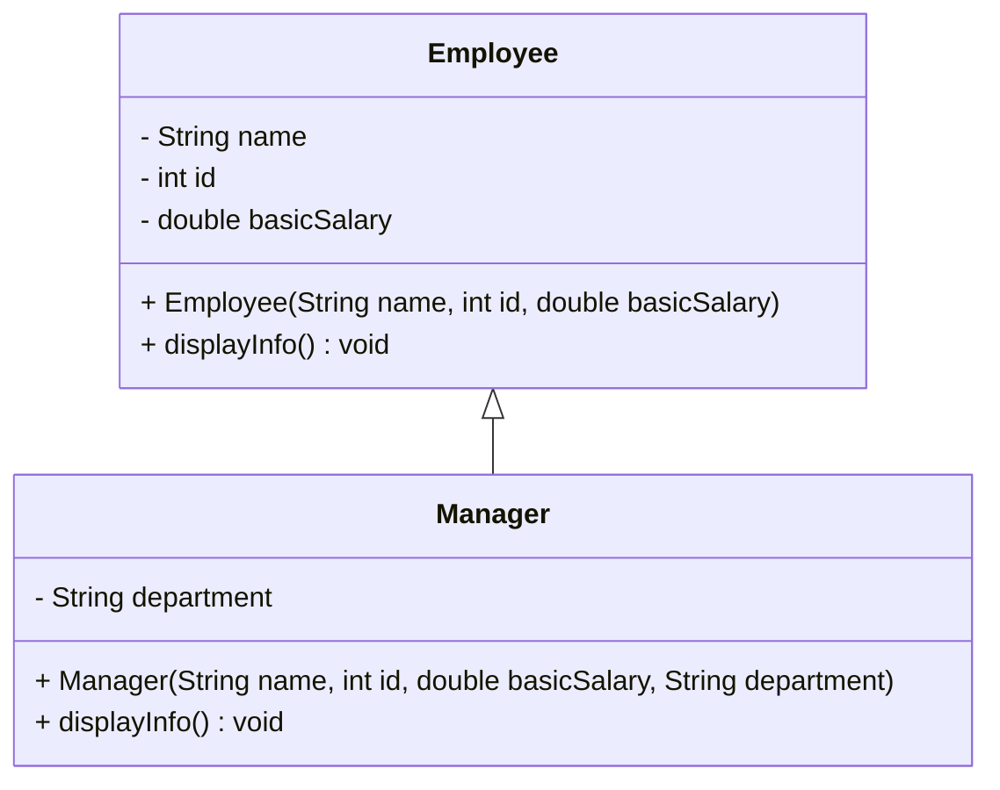

# Employee Hierarchy Using Inheritance (Java)
This repository contains a Java program that demonstrates the use of inheritance and method overriding through a simple employee hierarchy. The implementation follows standard object-oriented programming principles and clearly illustrates runtime polymorphism.
## Overview
The program defines a super class named Employee that stores general employee information such as name, ID, and basic salary. A derived class named Manager extends the Employee class by introducing an additional attribute for department information. The displayInfo() method is overridden in the Manager class to include the extended details.
## Concepts Demonstrated
 
- Inheritance 
- Method Overriding 
- Use of `super` keyword 
- Runtime Polymorphism 
 

## UML class diagram

## Features
 
- Models an employee hierarchy using object-oriented principles.
- Implements inheritance through a base `Employee` class and a derived `Manager` class.
- Demonstrates method overriding to achieve runtime polymorphism.
- Uses the `super` keyword to access superclass constructors and methods.
- Clearly illustrates runtime polymorphism
- Written using standard Java syntax and best practices

## Usage
- This repository is intended for academic purposes and can be used as a reference for understanding inheritance in Java.

## Author

- **Name:** Antor Chandra Bhowmick
- **ID:** 242002111
- **Green University Bangladesh**
- **Program:** B.Sc. in Computer Science and Engineering  
- **Purpose:** Lab Submission

